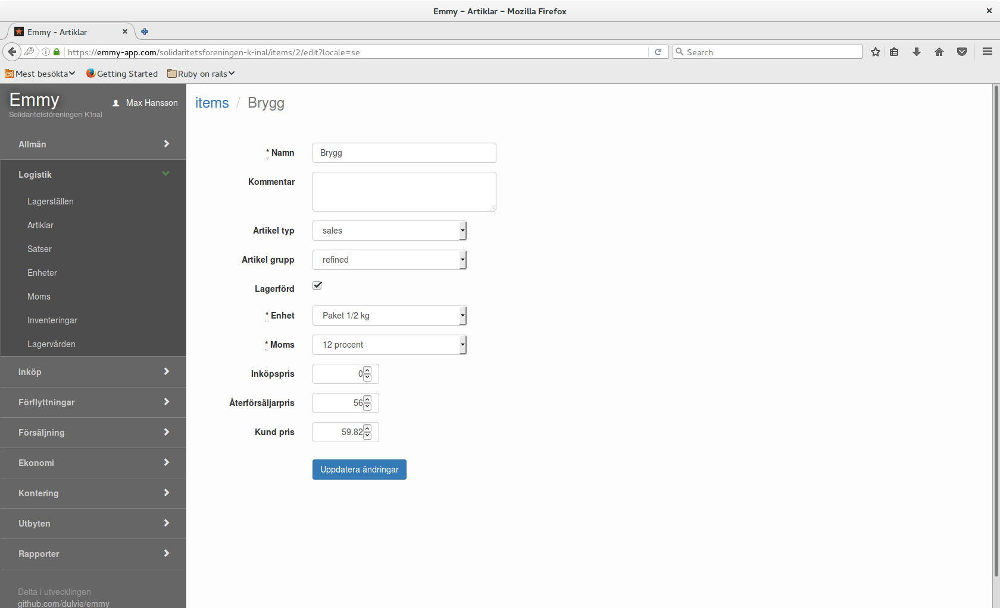
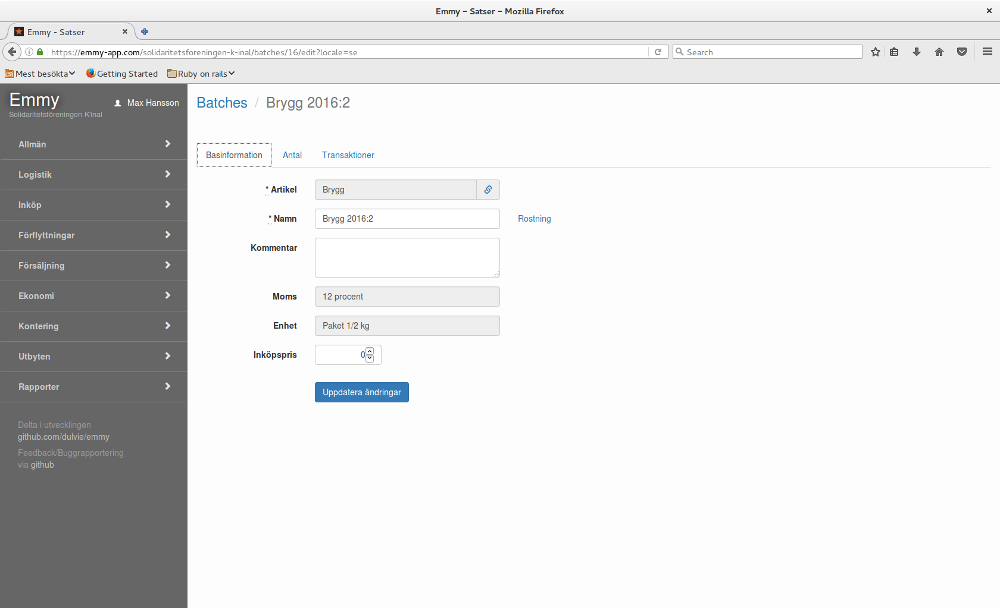

Uppgifter om artiklar som köps/säljs registreras på artiklar (items) och satser (batches). 
Artiklar är övergripande. Momssats och försäljningsenhet sätts. 

Obligatoriska uppgifter. 
**Namn**, **Enhet** och **Momssats**

**Lagerförd** innebär att satser kan registreras och systemet håller koll på kvantiteter.

Satsen kopplas till en övergripande artikel. Den får enhet och momssats från artikeln.

Under fliken basinformation
Koppling till **Artikel** och **Namn** är obligatoriskt.

Under fliken Antal
Här finns uppgifter om kvantiteter och på vilka lagerställen satserna finns

Under fliken Transaktioner
Här finns alla transaktioner som förändrat satsens kvantitet