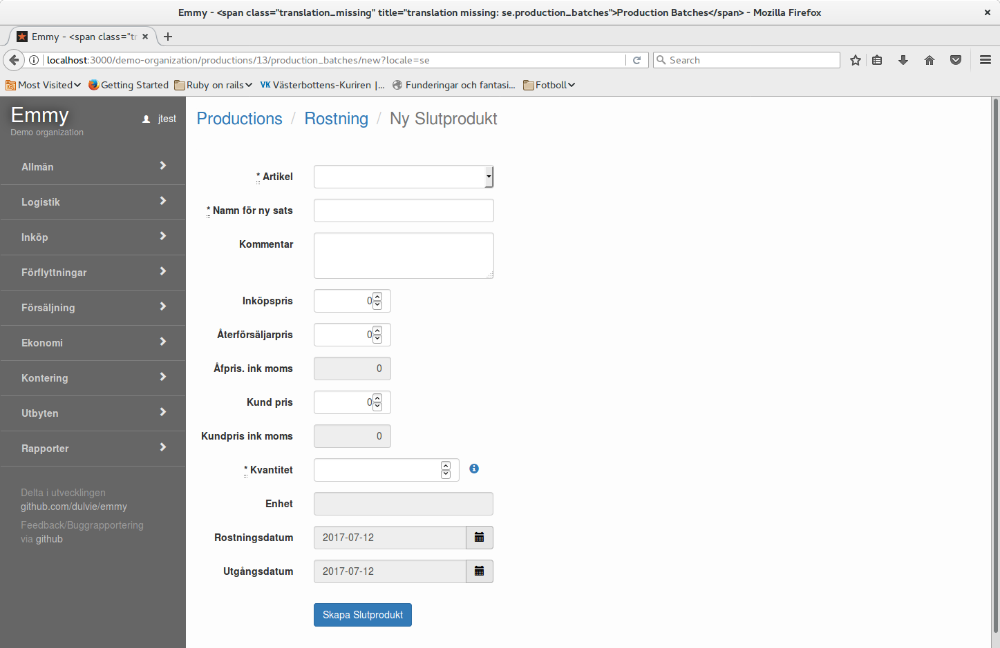
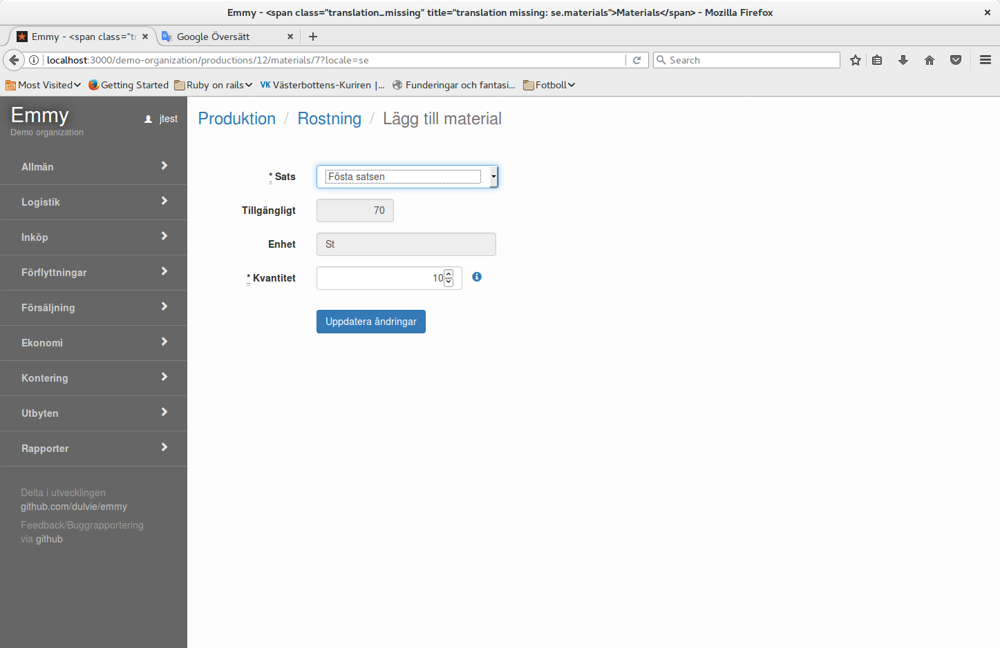
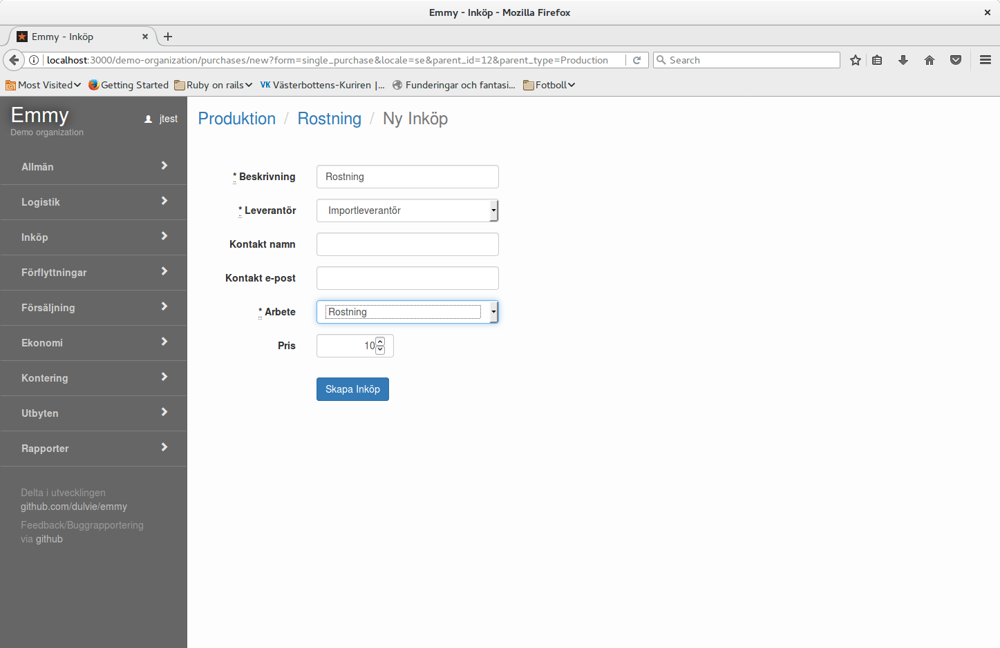

### Basinformation

- Produktion sker på ett lagerställe.
- Ny sats skapas.
- Ingående material måste finnas på lagerstället.
- Leverantör och artikel för beställning av arbete måste finnas registrerade.
 
### Arbetsgång

1. Skapa produktion
2. Ange slutprodukt och kvantitet 
3. Ange material och kvantitet
4. Beställ arbete
5. Starta 
   Ingående material dras från lagerstället.
6. Färdig
   Lagerstället fylls på med slutproduktens kvantitet. 

### Ange slutprodukt och kvantitet

Ny sats skapas. Lägg in uppgifter för satsen och den kvantitet som ska skapas.

### Ange material och kvantitet

Ange det material och kvantitet som behövs för slutprodukten. 
OBS! Det måste finna på det producerande lagerstället.

### Beställ arbete

Lägg upp inköp av arbete.
OBS! Leverantör och artikel för arbete måste finnas. 