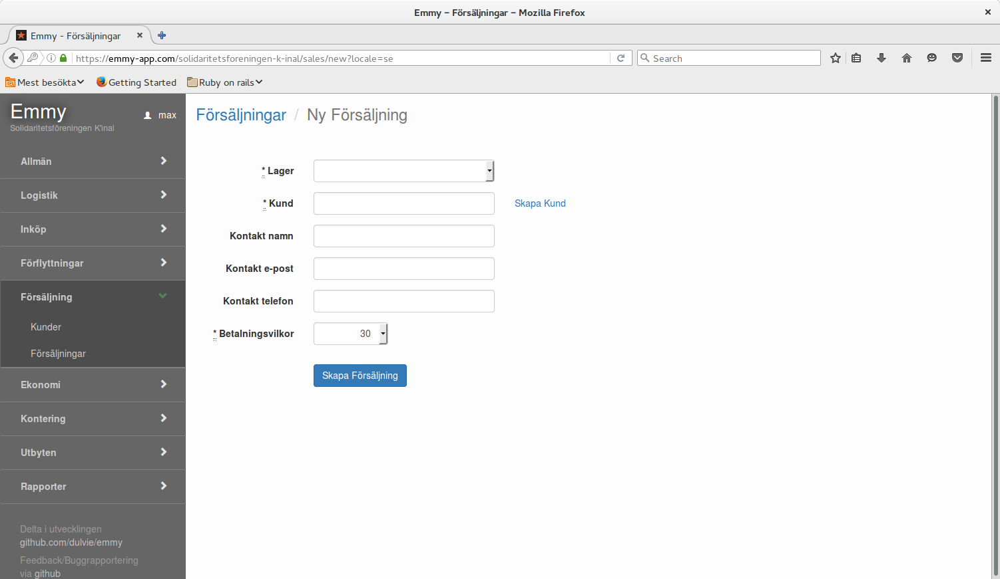
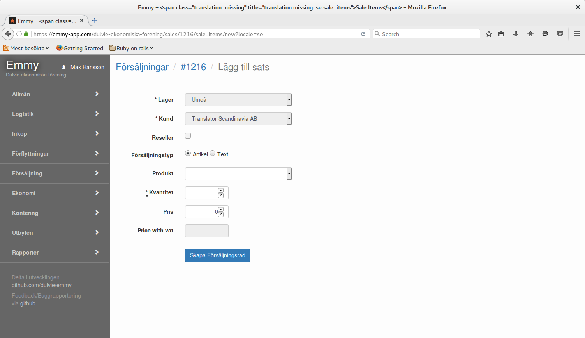

För att registrera en försäljning krävs följande uppgifter:

1.  Enheter finns registrerat (Logistik/Enheter)
2.  Momssatser finns registrerat (Logistik/Moms)
3.  Artiklar finns registrerade (Logistik/artiklar)
4.  Satser finns registrerade (Logistik/satser)
5.  Lagerställe finns registrerat (Logistik/Lagerställen)
6.  På lagerställets hyllor finns tillräckliga kvantiteter

### Försäljning kunduppgifter

1. Välj lager där försäljningen sker
2. Ange kund
   Om några bokstäverna anges så kommer en sökning att ske bland registrerade kunduppgifter.
   Saknas kunden kan länken till höger om registreringsfältet användas för att skapa en ny kunduppgift.
3. Kontaktuppgifter hos kunden kan registreras
4. Betalningsvillkor väljs.

### Försäljning artikeluppgifter

1. Välj försäljningstyp, artikel eller text
   Väljs artikel visas en lista av produkter som hämtas från registrerade artiklar eller satser.
   Väljs text kan valfri textrad registreras. OBS! Momssats måste anges.
2. Kvantitet anges
3. Pris exklusive moms anges. Om försäljningstyp artikel valts kommer prisförslag från artikel eller satsuppgiften.

#### Godkännande

När alla artiklar är registrerade och ordern godkänd används knappen beställd.
Försäljningens status blir Förberedd. PDF-dokument med fakturan skapas.

#### Leverans

När försäljningen levereras används knappen Levererad. Försäljningens status blir levererad.

#### Betalning

När betalning sker används kappen Betalad. Försäljningens status blir Betalad.
