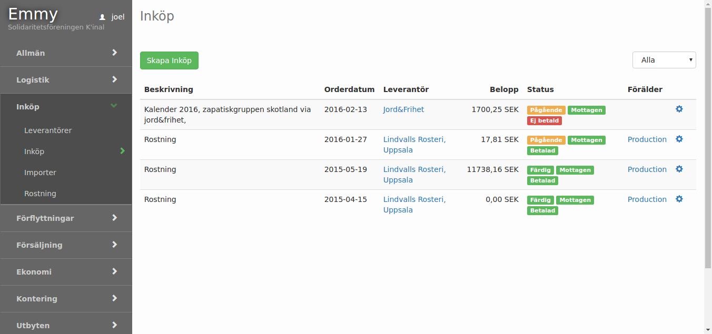

Registrera försäljning
Förutsätter följande uppgifter

1. Lagerställe finns registrerat (Logistik/Lagerställen)
2. På lagerställets hyllor finns aktuella kvantiteter
3. Enheter finns registrerat (Logistik/Enheter)
4. Momssatser finns registrerat (Logistik/Moms)
5. Artiklar finns registrerade (Logistik/artiklar)
6. I artiklar finns grunduppgifter som Artikel typ (purchase/sale/both)
Lagerförd (ska bockas i om systemet ska hålla reda på kvantiteter)
Enhet (den enhet som gäller)
Moms (den momssats som gäller)

### Försäljning lista:

>Satser finns registrerat
Det är satsen (Batches) som kvantitetshanteras. Den hänvisar till artikel för enhet och momssats. På satsen sätts det pris som gäller.
Kunder (Försäljning/Kunder) finns registrerat Registrering försäljning

1. Ange lagerställe där försäljningen sker
2. Ange kund
3. Ange första bokstäverna så kommer en sökning att ske bland registrerade
4. kunduppgifter.  Saknas kunden kan länken till höger om registreringsfältet användas för att skapa en ny kunduppgift.
5. Lägg till sats
6. Försäljningstyp har två alternativ. Artikel refererar till artiklar/satser som registrerats. De väljs under kolumnen produkt. Andra alternativet är text. En textrad som kan registreras på försäljningen. OBS! Anges textrad måste momssats väljas.  Pris anges före moms.

När alla artiklar är registrerade och ordern godkänd används knappen beställd.
Försäljningens status blir Förberedd. PDF-dokument med fakturan skapas.
När försäljningen levereras används knappen Levererad. Försäljningens status blir
levererad.
När betalning sker används kappen Betalad. Försäljningens status blir Betalad.
