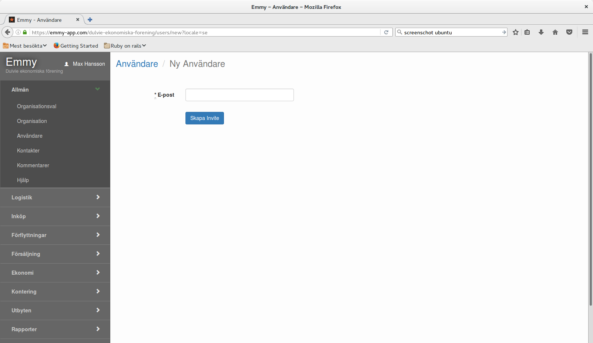
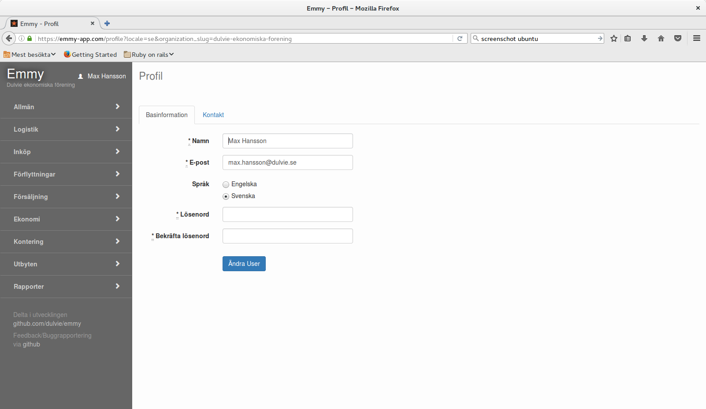

För att kunna logga på systemet måste en användare finnas. 
Användaren bjuds in till systemet via funktionen Användare/Inbjudan Användare. Inbjudan skickas via  e-mail.

Uppgifter om användaren finns under användarnamnet/Profil

Under fliken Basinformation finns användarnamnet och e-mail adressen.
Här väls språk och lösenordet kan bytas.

Under fliken Konakt kan kontaktinformation läggas upp.